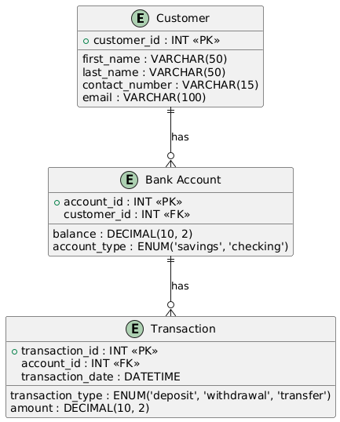

# Homework 7 - Database Design Process

### I. Entities and Relationships

1. **Customer:** Represents the bank's clients.
    - Attributes: customer_id, first_name, last_name, contact_number, email
2. **Bank Account**: Represents accounts held by customers.
    - Attributes: account_id, customer_id, balance, account_type
    - Relationship: A customer can have multiple bank accounts (One-to-Many).
3. **Transaction:** Represents financial transactions on accounts.
    - Attributes: transaction_id, account_id, transaction_type, amount, transaction_date
    - Relationship: An account can have multiple transactions (One-to-Many).

### II. **Entity-Relationship Diagram (ERD)**



### III. SQL Commands

- **Step 1: Create Database**
    
    ```sql
    DROP DATABASE IF EXISTS banking_app;
    
    CREATE DATABASE banking_app;
    USE banking_app;
    ```
    
- **Step 2: Create Tables**
    
    ```sql
    CREATE TABLE customer (
        customer_id INT AUTO_INCREMENT PRIMARY KEY,
        first_name VARCHAR(50) NOT NULL,
        last_name VARCHAR(50) NOT NULL,
        contact_number VARCHAR(15),
        email VARCHAR(100)
    );
    
    CREATE TABLE bank_account (
        account_id INT AUTO_INCREMENT PRIMARY KEY,
        customer_id INT,
        balance DECIMAL(10, 2) NOT NULL DEFAULT 0.00,
        account_type ENUM('savings', 'checking') NOT NULL,
        FOREIGN KEY (customer_id) REFERENCES customer(customer_id)
    );
    
    CREATE TABLE transaction (
        transaction_id INT AUTO_INCREMENT PRIMARY KEY,
        account_id INT,
        transaction_type ENUM('deposit', 'withdrawal', 'transfer') NOT NULL,
        amount DECIMAL(10, 2) NOT NULL,
        transaction_date DATETIME DEFAULT CURRENT_TIMESTAMP,
        FOREIGN KEY (account_id) REFERENCES bank_account(account_id)
    );
    ```
    
- **Step 3: Insert Sample Data**
    
    ```sql
    INSERT INTO customer (first_name, last_name, contact_number, email) VALUES 
    ('An', 'Ho', '0934025192', 'an.ho@gmail.com'),
    ('Huy', 'Nguyen', '0987654321', 'huy.nguyen@gmail.com');
    
    INSERT INTO bank_account (customer_id, balance, account_type) VALUES 
    (1, 1200.00, 'savings'),
    (1, 2900.00, 'checking'),
    (2, 4500.00, 'savings');
    
    INSERT INTO transaction (account_id, transaction_type, amount) VALUES 
    (1, 'deposit', 500.00),
    (1, 'withdrawal', 200.00),
    (1, 'transfer', 300.00),
    (2, 'deposit', 1000.00),
    (2, 'withdrawal', 1500.00),
    (3, 'deposit', 750.00),
    (3, 'transfer', 200.00),
    (3, 'withdrawal', 100.00),
    (1, 'deposit', 600.00),
    (2, 'transfer', 500.00);
    ```
    

### IV. Results

